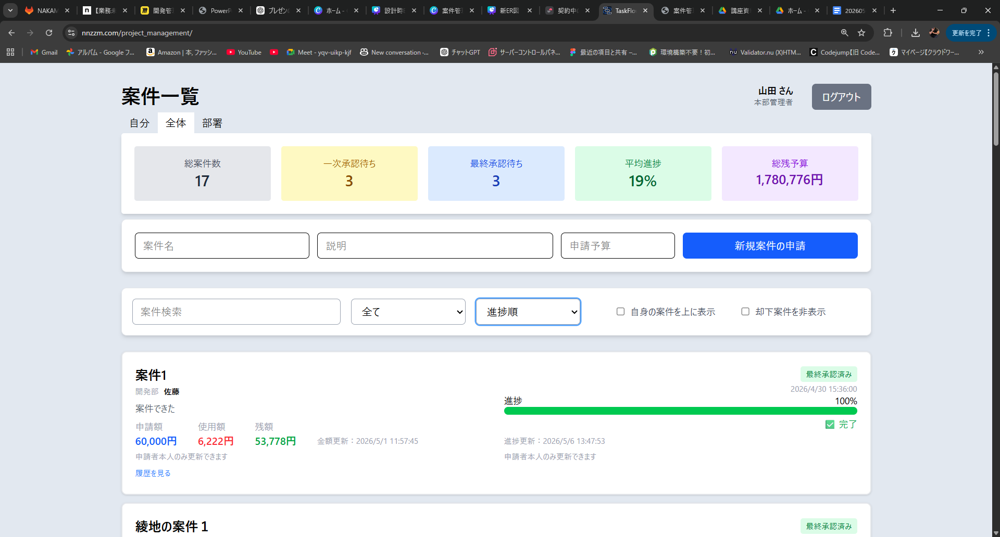
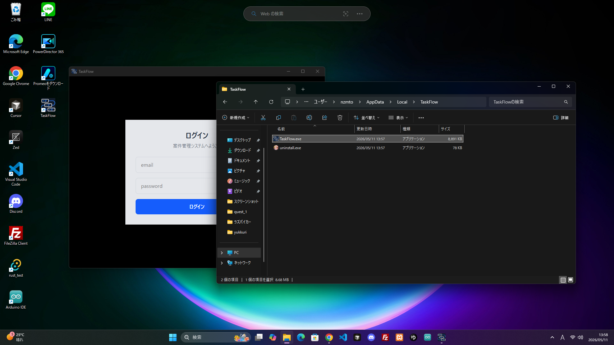

# TaskFlow

- URL: https://www.nnzzm.com/project_management/



## 概要
TaskFlow は案件管理・承認フローを行う Web アプリです。

React + PHP + MySQL を使用して開発し、
ESP32 を用いた IoT 連携機能も実装しました。

## 主な機能
- ログイン機能
- 案件作成
- 承認フロー
- 進捗管理
- 予算管理
- 権限管理
- IoT連携（LED表示）

## 使用技術

### フロントエンド
- React
- TypeScript
- Vite
- Tailwind CSS

### バックエンド
- PHP
- MySQL

### IoT
- ESP32
- NeoPixel LED

## デスクトップアプリ対応

Tauri を使用して Windows デスクトップアプリ化を行いました。

- React + TypeScript の既存フロントエンドを再利用
- Rust ベースの Tauri を採用
- Windows インストーラー（.exe）を生成
- 本番環境の PHP API と HTTPS 通信



### 使用技術
- Tauri
- Rust

## ディレクトリ構成

```text
frontend/   フロントエンド
doc/        提出資料
```

詳細資料は doc フォルダを参照してください。

- Information.md
- manual_nakamura.pdf
- presentation_nakamura.pdf
- deploy/
- ER/

## 補足

- 開発用バックエンド：backend
- 本番環境用バックエンド：db.prod