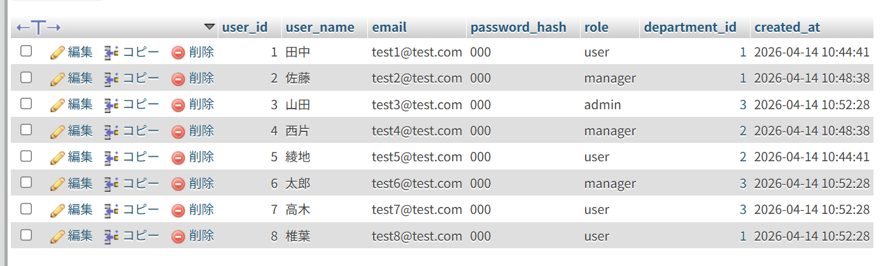

# Information

## アプリ情報
- アプリ名: TaskFlow
- URL: https://www.nnzzm.com/project_management/

## 動作確認用アカウント

| 権限 | メールアドレス | パスワード |
|---|---|---|
| admin | test3@test.com | 000 |
| manager | test2@test.com | 000 |
| user | test1@test.com | 000 |

## デプロイ環境
- サーバー: さくらのレンタルサーバー
- ドメイン: nnzzm.com
- フロントエンド: React + Vite
- バックエンド: PHP / MySQL
- IoT連携: ESP32

## 補足
詳細資料は doc フォルダ内の PDF を参照してください。

## 資料一覧
- manual_nakamura.pdf
- presentation_nakamura.pdf

### deploy
- deploy_nakamura.pdf
- test_account_nakamura.pdf

### ER
- new_er.pdf
- old_er.pdf